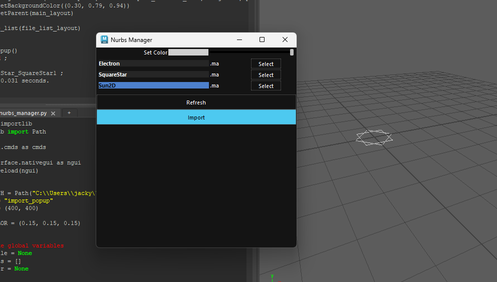
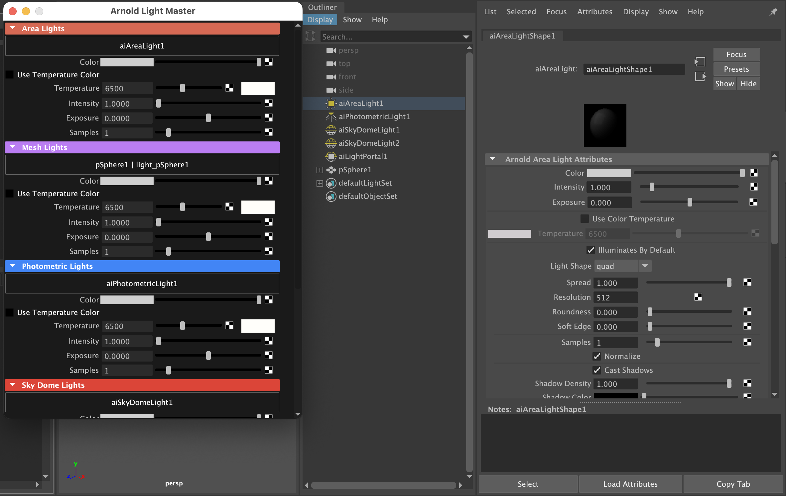

# Autodesk Maya Extension

This is a repo dedicated to writing scripts to speed up your Maya workflow.

*If you are reading this, you are probably reading the <a href="https://github.com/jacky776690g60/MayaMedic">temporary public repo</a>.*

## **How to install**

1. Add a `userSetup.py` to this path

   * Windows: `C:\Users\username\Documents\maya\scripts`

   * MacOS: `/Applications/Autodesk/maya2024/plug-ins/MASH/scripts/userSetup.py`

2. In `userSetup.py`, add the following:
 
   ```PYTHON
   import sys
   from pathlib import Path

   MAYAMEDIC_INSTALLED_PATH = Path("C:\\Where\\you\\put\\the\\folder\\MayaMedic")
   sys.path.append(str(MAYAMEDIC_INSTALLED_PATH))

   print("MayaMedic installed at: {}".format(MAYAMEDIC_INSTALLED_PATH))
   ```
3. Now, Maya will automatically load the script on startup.

## **Samples**

- #### Nurb Curves Manager:

  A quick nurb curves manager to help you import nurb controllers based on different colors.



- #### Arnold Light Manager

  The manager allows you to control all arnold lights in the scene
  
  